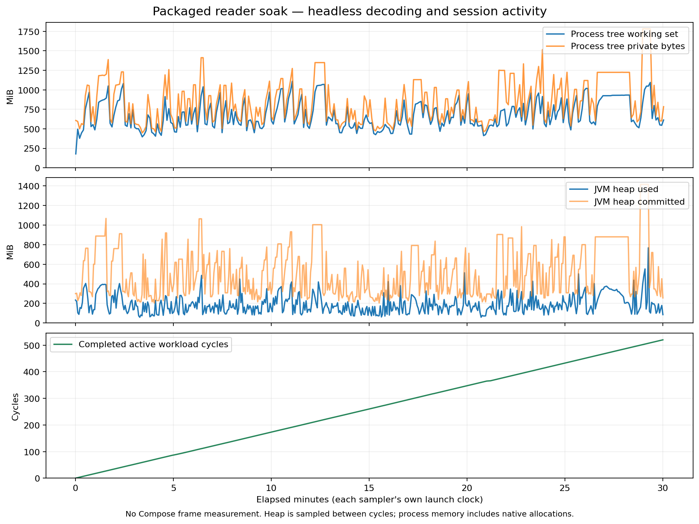

# Current 0.2.18 packaged reader soak

Verified on Windows on 2026-09-18. Main baseline `e143cc6c4`; packaged production
revision `de1b8bd6bb2312641fa1197abd9eb085cec32e02`, dirty=false. The main baseline
and packaged revision have identical desktop-app, reader-core and extension-sdk
contents. No application rebuild or replacement occurred during the run.

## Result and remaining gap

The active headless reader workload completed **1800.684 seconds, 520 cycles and
19,760 decoded tiles in one JVM (51444)**. The native launcher (72048) and sampler
(37684) exited 0. Both stderr streams were empty. The processes terminated normally.

This passes the continuous workload check. **The memory plateau target is not yet
established.** Although memory repeatedly falls, the final complete five-minute
window has higher medians and a higher private-memory peak. This is evidence for
further allocation/collection investigation, not proof of either a leak or a stable
plateau. The runner's `accepted=true` means the workload completed successfully;
it does not accept the broader T9 memory or rendering targets.



## Measurements

All memory values below are MiB (1,048,576 bytes). Process values include the
launcher and JVM child; heap values describe only the JVM.

| Metric | Minimum | Median | Maximum |
| --- | ---: | ---: | ---: |
| JVM heap used | 58.343 | 171.781 | 767.882 |
| Process tree working set | 178.117 | 625.129 | 1109.547 |
| Process tree private bytes | 447.531 | 813.004 | 1782.086 |

The independent core-budget poller recorded a high water of **171,819,520 bytes**
(163.860 MiB), below the existing 256 MiB reader budget. Cache high water was
18,851,792 bytes (17.978 MiB). That budget is not an entire-process memory limit.

| Complete window (minutes) | Heap median | Working-set median | Private-byte median | Private-byte maximum |
| --- | ---: | ---: | ---: | ---: |
| 0–5 | 177.291 | 566.918 | 722.658 | 1387.535 |
| 5–10 | 162.182 | 604.266 | 786.988 | 1411.570 |
| 10–15 | 170.751 | 617.971 | 746.582 | 1348.691 |
| 15–20 | 162.674 | 584.465 | 693.828 | 1131.184 |
| 20–25 | 165.518 | 626.934 | 813.004 | 1515.703 |
| 25–30 | 210.288 | 850.145 | 1119.275 | 1782.086 |

The trailing 0.684-second partial window is retained in the JSON but excluded from
the comparison. Heap and process samplers use separate launch clocks; window
boundaries are not exact cross-stream synchronization. Heap samples occur between
completed cycles, so the recorded maximum is a sampled maximum, not an allocation
profiler's instantaneous peak.

There are 522 reader samples and 311 process samples. Reader progress is monotonic,
all reader samples have PID 51444, and first/final counters match the completed
workload. Maximum reader sample gap is 11.306 seconds; maximum process sample gap
is 6.21 seconds. The process sampler observes PIDs 51444 and 72048. These intervals
do not measure UI responsiveness or frame latency.

## Workload, hardware and provenance

Each cycle evicts unpinned cache entries and repeats standalone image, directory,
CBZ, CBT, CB7, CBR and EPUB decoding; transparency, distinct GIF frames, corrupt
image isolation and region decoding from a 20,000 × 20,000 image are included. It exercises
all six reading modes, crosses chapters, and flushes/reopens reading progress.
Final output confirms seven asset types, six modes, two distinct GIF hashes and
six persisted chapter progress rows. Chapters contain 1–8 pages: this is **not a
long-chapter acceptance test**.

Reference machine: Intel Core i9-13980HX, 24 cores / 32 logical processors,
33,954,439,168 bytes RAM, Windows 11 Home Insider build 26220. Start time was
2026-09-17 22:56:54 UTC (2026-09-18 06:56:54 local). Runtime data was isolated under
`build/reader-soak-0218/full/profile`; the user's profile was not accessed.

Package and fixture identities:

- Version: 0.2.18.
- EXE SHA-256: `329b002304fa801d368a14c3875b92780c37bf81d3c101efaa5ff8a8287aef88`.
- App JAR SHA-256: `9a77edcf86c5cdd82e7ef05ed3c4650c1166ab48ba19da379b18cc3c38a0dfaa`.
- Portable ZIP SHA-256: `240d8e8f000202c07a57a55c8655272dc558d13d121e56c93f2dd8a4a2f6e237`.
- Fixture manifest SHA-256: `9faf51d89d29b547f6db4c54d3d27a5a2ebaa625961255ae0bb2bfa754df7038`.

EXE/JAR hashes were checked again after completion and remained unchanged. The ZIP
hash matches the previously verified portable artifact. No release was uploaded
and no installation into the user's profile was performed. MSI/installer outputs
remain outside this acceptance scope.

## Reproduction and retained evidence

The committed [evidence directory](reader-soak-0.2.18/) contains original reader
and process JSONL streams, identity, completed result, verifier output, empty stderr
copies, analysis, the PNG curve and a SHA-256 manifest. Profile data is excluded.
The original run remains under `build/reader-soak-0218/full`.

```powershell
./scripts/verify-reader-soak.ps1 `
  -Executable './desktop-app/build/compose/binaries/main/app/mihondesk/mihondesk.exe' `
  -FixtureDirectory './build/reader-soak-0218/fixture' `
  -OutputDirectory '<new run directory>' -DurationSeconds 1800
./scripts/summarize-reader-soak.ps1 -OutputDirectory '<run directory>'
python ./scripts/plot-reader-soak.py '<run directory>'
```

Plotting was verified with Matplotlib 3.10.8. A short native-EXE preflight passed;
the summary also rejects copied evidence with a mismatched PID, final count,
backwards time or missing runtime in the process stream.

Next: collect GC/allocation evidence using this exact packaged runtime in a
separate diagnostic run, correlate retained heap with process memory, and address
a demonstrated cause before repeating acceptance. Do not add forced GC, change
heap limits or weaken the memory target simply to produce a flatter graph. Full
T9/T11 still require long chapters, native Compose/UI measurements, representative
production sources, and clean Windows installation/upgrade acceptance.
