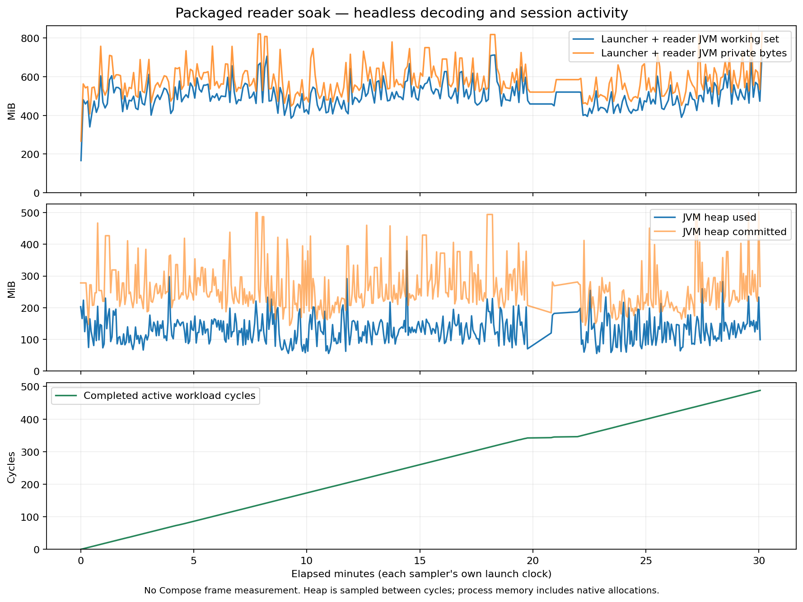

# Existing reader implementation with an isolated 768 MiB maximum heap

The original main implementation completed a 30-minute EXE workload with lower sampled memory
than the earlier unbounded-heap run. This remains an experimental launcher configuration: production
heap defaults were not changed, and the separate 7z cache candidate was not included. Two roughly
62-second gaps prevent accepting this run as continuous-reading stability or responsiveness evidence.

## Identity and workload

- Local main: `6dafdc5227896cd1ce486c47d1a8b5b69c4755dd`, version **0.2.18**.
- Re-fetched `origin/main`: `90662a9f7089dd4bb210b140209bd0da4205d69c`, version **0.2.13**.
  Local main was 44 commits ahead. No push or release was performed.
- EXE: `build/reader-bounded-baseline/app/mihondesk.exe`, an isolated copy of the baseline image.
- Embedded production revision: `de1b8bd6bb2312641fa1197abd9eb085cec32e02`, build metadata `dirty=false`.
  Reader/app production source and relevant build/dependency definitions were checked against main
  and were identical. The experimental `.cfg` is separate from the original build metadata.
- Only additional JVM option: `-Xmx768m`. No GC logging, JFR, NMT or forced collection.
- Launcher 86288, JVM 65296, sampler 80484. All process samples contain exactly the owned launcher
  and JVM; no excluded or missing process rows. Terminal EXE and sampler exits were both **0**;
  `stderr.log` and `sampler.stderr` were empty.
- **1803.135171801 seconds, 488 cycles, 18544 decoded tiles**, 490 reader and 308 process samples.
  Headless decoding/session workload; the fixture still has short chapters and does not render Compose.

## Memory observations

| Sampled metric, MiB | Earlier default heap | Experimental 768 MiB heap |
|---|---:|---:|
| Heap used median | 171.781 | 127.472 |
| Heap used maximum | 767.882 | 379.255 |
| Launcher + JVM working set median | 625.129 | 489.568 |
| Launcher + JVM working set maximum | 1109.547 | 725.543 |
| Launcher + JVM private bytes median | 813.004 | 561.600 |
| Launcher + JVM private bytes maximum | 1782.086 | 829.977 |

The baseline comparison is the completed 520-cycle run documented in
[the original reader soak](2026-09-18-current-reader-soak.md). These are sequential observations on
a development machine, not a randomized causal comparison. The heap setting also changes G1
ergonomics; this is not a pure retained-object experiment. Private bytes include allocations outside
the Java heap. Active reading memory is not the product's idle-memory metric.

Five-minute private-byte medians remain in an approximately 521–596 MiB band. This is encouraging
for footprint, but the interrupted activity and absence of real reader rendering keep the T9
30-minute reading acceptance gate open.

## Continuity limitation

Reader samples show gaps from 1185.750 to 1248.593 seconds and from 1256.491 to 1318.570 seconds;
each interval completed only one cycle. During the latter interval, multiple process samples show
essentially unchanged JVM CPU time and memory. The sampler itself has a maximum gap of **30.220 s**;
the maximum reader gap is **62.843 s**. Each stream has its own start clock, as labelled on the plot.
No matching Kernel-Power event was returned by the narrow live query, which does not establish
the cause. Do not attribute this to GC, a leak, sleep or the heap limit without further evidence.

The verifier's `accepted=true` means its duration, decoding/progress and terminal-exit checks passed.
It is not a memory plateau, frame pacing or absence-of-stalls verdict. Retain these gaps; do not
remove them to claim uninterrupted activity. Future diagnostics should capture phase/thread state
at a stall, separately from a clean performance control.

## Reproduction and provenance

Run `scripts/verify-reader-soak.ps1` with the isolated EXE, the existing
`build/reader-soak-0218/fixture`, a new output directory, and `-DurationSeconds 1800`.
Then run `scripts/summarize-reader-soak.ps1 -MainProcessesOnly` and
`scripts/plot-reader-soak.py --main-processes-only` on that completed output directory.

The [archive](reader-bounded-baseline-0.2.18/SHA256SUMS.txt) preserves raw streams, identity,
configuration, summaries, comparison baseline summary, analysis scripts and plots. `.cfg`, app JAR
and reader-core JAR hashes were rechecked after exit against the recorded configuration. No profile,
fixture content, personal data or binaries are included in the evidence archive.
